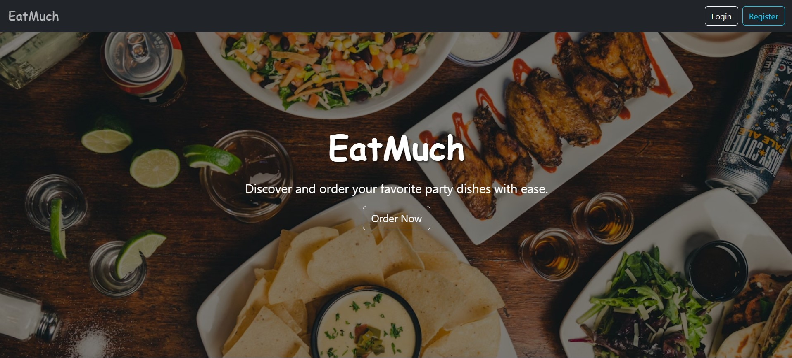
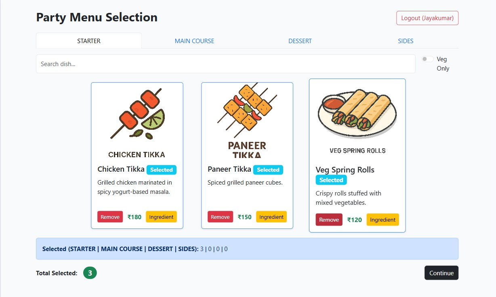
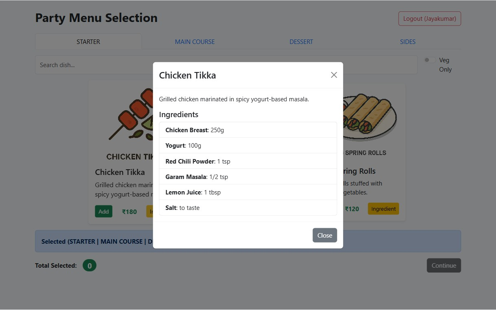
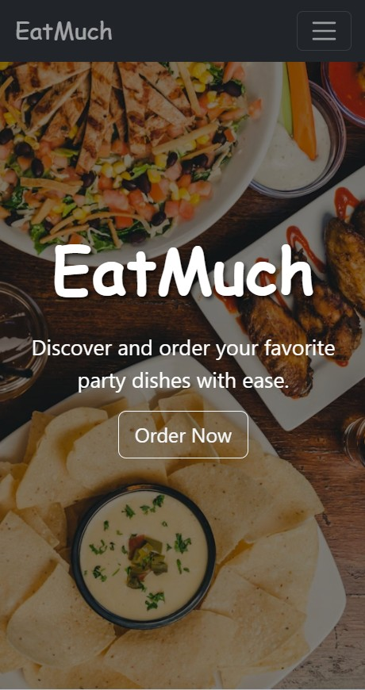
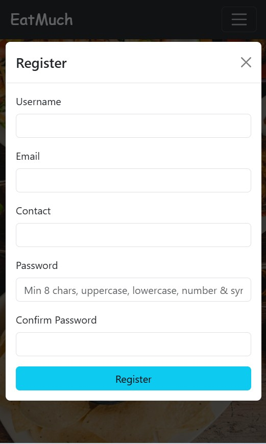
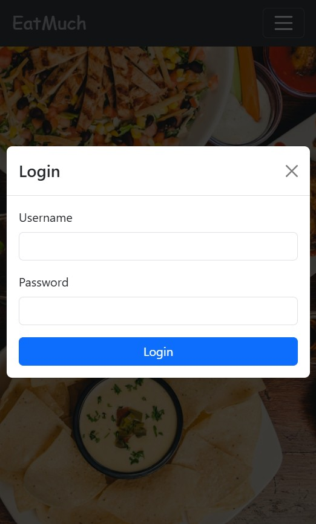
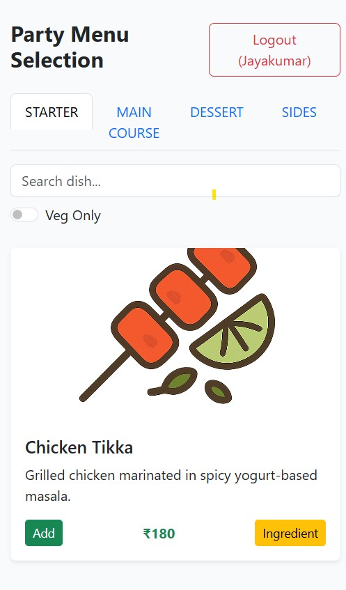
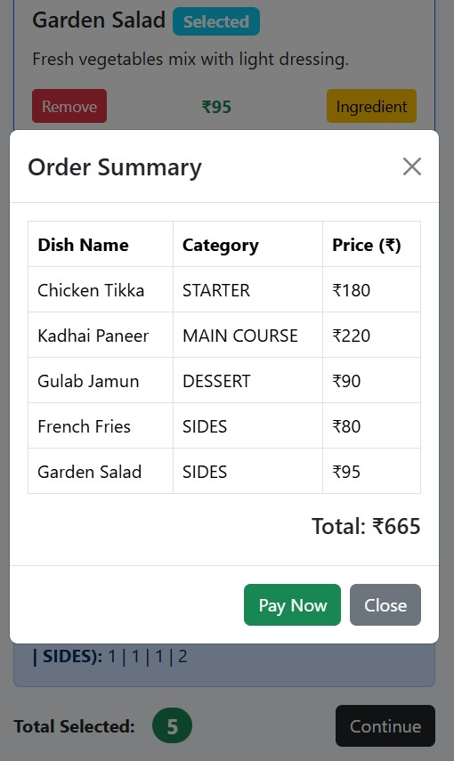

# EatMuch - Party Menu Selection Web App

---

## Table of Contents

 [Project Overview](#project-overview)  
 [Features](#features)  
 [Technologies Used](#technologies-used)  
 [Installation](#installation)  
 [Usage](#usage)  
 [Screenshots](#screenshots)  
 [Future Improvements](#future-improvements)  
 [Author & License](#author--license)

---

## Project Overview

EatMuch is a responsive React web app providing an intuitive platform to explore, filter, and select party menu dishes across multiple categories. The app supports user registration and login with form validations, a beautiful landing page with full-screen background, and an engaging menu selection experience with ingredient details and order summary.

---

## Features

 Secure user registration and login with client-side validations  
 Responsive design with full-page background and blinking website name  
 Hamburger menu for small screens with Login/Register options  
 Category tabs, search functionality, and vegetarian-only filter  
 Interactive dish cards with Add/Remove and Ingredient details  
 Order summary modal with detailed cost breakdown  
 LocalStorage persistence for registered users (demo purpose)  

---

## Technologies Used

 React 18  
 React-Bootstrap 2.x / Bootstrap 5  
 JavaScript ES6+  
 CSS3 with media queries  
 Vite

---

---

## Installation

1. Project Installation: 

        npm create vite@latest party-menu-app
        build : React-Vite

2. Install dependencies:

    dependencies: 
        bootstrap,
        react
        react-bootstrap,
        react-dom

3. Run the development server:  npm run dev

---

## Usage

 **Landing Page:** Discover the brand EatMuch with a stylish background. Access login and register from navbar or hamburger menu.  
 **Register:** Fill in username, email, contact, and password (with strong validation). On successful registration, a confirmation prompts login.  
 **Login:** Enter credentials with loading spinner feedback. Successful login redirects to the menu.  
 **Menu:** Browse dishes by category, search, filter vegetarian options. Add or remove dishes and view ingredients.  
 **Order Summary:** Review selected dishes and total. Option to "Pay Now" (demo).  
 **Logout:** Securely log out and return to the landing page.

---

## Screenshots

### Desktop View  
  
  
  

### Mobile View  
  
  

 

      

---

## Future Improvements

 Integrate with secure backend for authentication and data persistence  
 Add payment gateway integration  
 User profile and order history pages  
 Accessibility enhancements  
 Internationalization support

---

## Author

Created by [Jayakumar S]

---

*Thank you for exploring EatMuch!*
